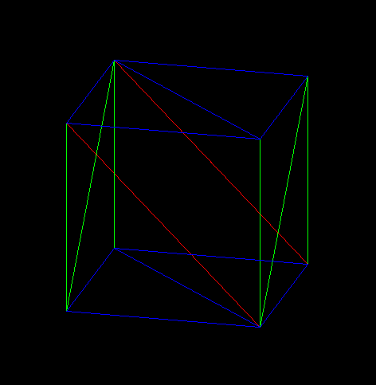

# TinyRenderer
Quick and dirty 3d renderer

This is somewhat of a quick remake of an older project whose goal was to render wireframe objects froma given map file using projection.

This project however aims to go a little bit further and render faces of given objects, so that I may have a fast way of rendering 3D things in future projects.
I may or may not improve this in future but it is most likely that I will make an entirely new project should the need arise for a better renderer. 
The main changes over the old projects would be a better overall program structure and a different file format and parsing.

Implemented all transforms, the only missing thing is a camera and z-buffering / backface culling. At the moment faces are rendered in the order they were initialized

